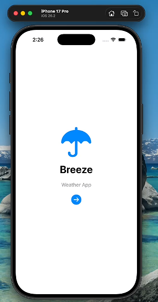
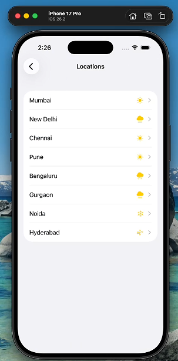
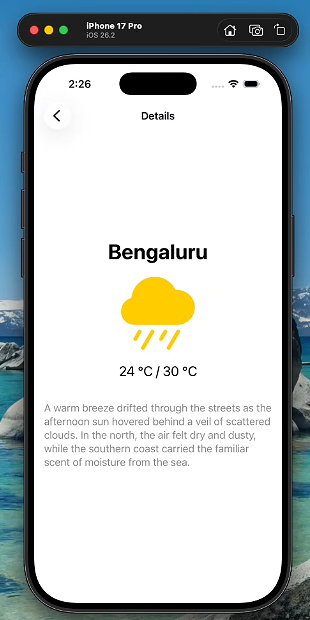

# WeatherApp 

###  Home Screen

###  City List Screen

###  Weather Detail Screen

---

##  Project Structure

### Views (UI Screens)
- `ContentView.swift` → Landing screen  
- `ListScreen.swift` → City list screen  
- `DetailScreen.swift` → Weather detail screen  

### Models (Data)
- `Location.swift` → City model  
- `Temperature.swift` → Temperature model  
- `Weather.swift` → Weather type and icon logic  
- `LocationData.swift` → Dummy weather data  

